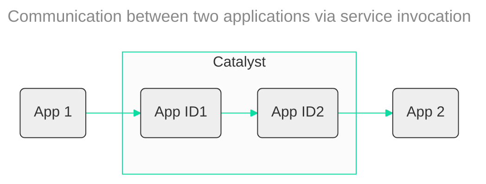
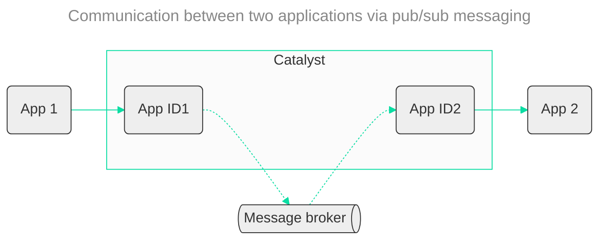
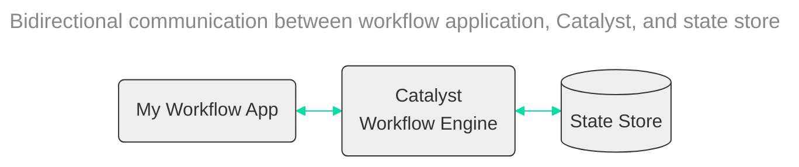
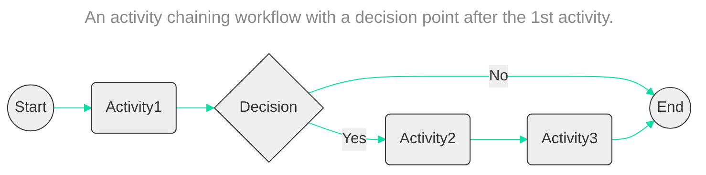

- Flowchart is the default diagram type that should be used unless explicitly asked otherwise.
- The default direction should be left to right (LR) unless the number of nodes are more than 5, then use top down (TD).
- Each application/service requires an AppID in Catalyst. The AppID nodes should be part of a subgraph named Catalyst. 
- If a Catalyst node or subgraph is present in the diagram the stroke color of that node or subgraph should be #0bdda3.
- If a diagram of a workflow with its activities should be drawn using unidirectional lines between the activities `-->`. A Workflow always starts with a Start node and ends with an End node.

## Node formats

- Application or service node: `APP(My App)`
- Catalyst node: `CAT(Catalyst)`
- State store node: `STATE[(State store)]`
- Pub/Sub message broker or queue: `BROKER@{ shape: das, label: "Message broker" }`
- Workflow activity node: `ACT(Activity)`
- Workflow start node: `START((Start))`
- Workflow end node: `END((End))`
- Workflow decision node: `CHOICE{Check}`

## Line formats

- Regular line: `-->`
- Bidirectional line: `<-->`
- Line with label: `--"Label"-->`
- Async communication line (for pub/sub): `-.->` 

## Examples

